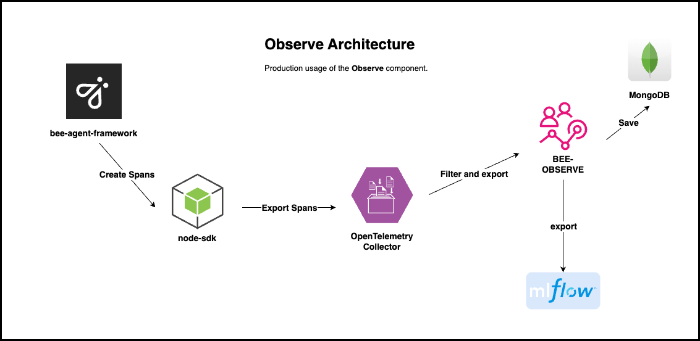

> [!WARNING]  
> 
> This repository has been archived and is no longer actively maintained or updated. It is provided here for historical reference and may contain outdated or unsupported code. Users are encouraged to fork or adapt the contents as needed, but please note that no further updates, bug fixes, or security patches will be applied by the original maintainers.

<p align="center">
  <picture>
    <source media="(prefers-color-scheme: dark)" srcset="/docs/assets/Bee_logo_white.svg">
    <source media="(prefers-color-scheme: light)" srcset="/docs/assets/Bee_logo_black.svg">
    
  </picture>
</p>

<h1 align="center">Bee Observe</h1>

<p align="center">
  <a aria-label="Join the community on GitHub" href="https://github.com/i-am-bee/bee-observe/discussions">
    
  </a>
  <h4 align="center">Open-source observability service for Bee Agent Framework</h4>
</p>

`Bee Observe` is a REST API with OpenAPI documentation designed to collect information about `bee-agent-framework` events in the Opentelemetry format and save them as a Trace entity with additional information about `request`, `response` etc. to a **MongoDB** database. This app is built using the **Fastify** framework.



## Table of Contents

1. [👩‍💻 Get started with Observe](#-get-started-with-observe)
2. [🪑 Local set-up](#-local-set-up)
   - [Prerequisites](#prerequisites)
   - [Steps](#steps)
3. [🚀 Run](#-run)
   - [Running the server via Docker](#running-the-server-via-docker)
   - [Running the Server via Node.js](#running-the-server-via-nodejs)
   - [Development Mode](#development-mode)
4. [🪑 Setup with OpenTelemetry](#-setup-with-opentelemetry)
5. [🧪 Run tests](#-run-tests)
6. [📣 Publishing](#-publishing)
7. [Code of conduct](#code-of-conduct)
8. [Legal notice](#legal-notice)
9. [📖 Docs](#-docs)

## 👩‍💻 Get started with Observe

> The running Observe instance uses the `Redis`, `MongoDB` and `Mlflow` services. See `./compose-before.yml` for more info on how to run them.

1. create .env.docker file

   > Use the `BASE_AUTH` authorization strategy in the production. See `MLFLOW_AUTHORIZATION` env variable.

   > Use TLS certificate for MongoDB and Redis. See `MONGODB_CA_CERT` and `REDIS_CA_CERT` env variables.

Create the `.env.docker` file and specify the environment variables. See a list of [supported environment variables](./.env.example).

2. Start the `observe_api` service

```
docker run --name observe_api -p 3000:3000 --env-file .env.docker iambeeagent/bee-observe:tagname
```

## 🪑 Local set-up

### Prerequisites

- Node.js (version managed using `nvm`)
- Yarn package manager (`corepack`)
- Docker (we recommend using [Rancher Desktop](https://rancherdesktop.io/))
- Git

### Steps

1. Clone the repository:

```bash
   git clone git@github.com:i-am-bee/bee-observe
   cd bee-observe
```

2. Use the appropriate Node.js version:

```
nvm use
```

3. Install dependencies

```
yarn
```

4. Prepare .env file
   Create a .env file in the root directory of the project and configure the necessary environment variables.
   Copy all (from `.env.example`) and fill in values.

5. Run infra
   To start all necessary services like `redis`, `mongo` and `mlflow` run this command:

```
yarn start:infra
```

6. Run migrations

```
yarn migration:up
```

### 🚀 Run

#### Running the server via Docker

1. Build the docker image

```
docker compose build
```

2. Start the `observe_api` service

```
docker compose up -d
```

#### Running the Server via Node.js

1. Build the source code

```
yarn build
```

2. To start the Fastify server, use the following command:

```
yarn start
```

#### Development Mode

For development mode with hot-reloading, use:

```
yarn dev
```

### 🪑 Setup with OpenTelemetry

The Observe service can be used only with the [bee-agent-framework](https://github.com/i-am-bee/bee-agent-framework).
See [OpenTelemetry Instrumentation in Bee-Agent-Framework](https://github.com/i-am-bee/bee-agent-framework/blob/main/docs/instrumentation.md) for instructions on how to enable the instrumentation there.

For more info on setting up observe service in the [OpenTelemetry collector](https://opentelemetry.io/docs/collector/) read the [Configuration](https://opentelemetry.io/docs/collector/configuration/#exporters) page.

### 🧪 Run tests

> This project uses integration API tests that require a running observe instance to be executed.

```
yarn test
```

The coverage

```
yarn coverage
```

### Code of conduct

This project and everyone participating in it are governed by the [Code of Conduct](./CODE_OF_CONDUCT.md). By participating, you are expected to uphold this code. Please read the [full text](./CODE_OF_CONDUCT.md) so that you can read which actions may or may not be tolerated.

## Legal notice

All content in these repositories including code has been provided by IBM under the associated open source software license and IBM is under no obligation to provide enhancements, updates, or support. IBM developers produced this code as an open source project (not as an IBM product), and IBM makes no assertions as to the level of quality nor security, and will not be maintaining this code going forward.

## 📖 Docs

Read all related document pages carefully to understand the Observer API architecture and limitations.

- [Overview](./docs/overview.md)
- [API](./docs/api.md)
- [Data persistence](./docs/data-persistence.md)
