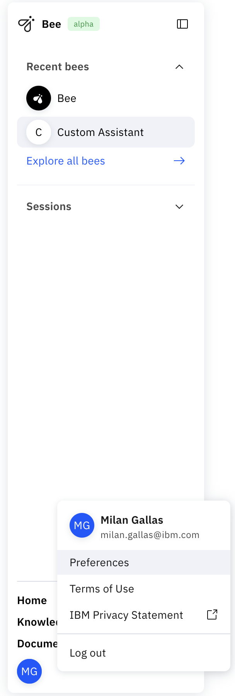

## Overview
### General
This API service is used for collecting the `trace` from the [framework's](https://github.com/i-am-bee/bee-agent-framework) runs.

The easiest implementation on how to collect data from the framework is directly via the [**bee-observe-connector**](https://github.ibm.com/Incubation/bee-observe-connector) (TODO:) that collects all events (`spans`) from the [framework emitter](https://github.com/i-am-bee/bee-agent-framework/blob/main/docs/overview.md#emitter) and sends it to the Observe via 1 request when collecting the final answer or catching a final/fatal error.

This observation component was designed to only collect the data from the agent framework to have a deep view of the run process: how to agent figures the final answer out, information about the used tools, thoughts, raw prompts and other details.

> This component was not designed to collect the system logs and no other system data that should be processed in some Ops tools.

We use the Mlflow tools for trace visualization. So each trace is saved twice: (In mongoDB in the observe API, in the mlflow).

### How to start with observe/mlflow
We collect some data about the framework and a specific run in the mentioned [connector](https://github.ibm.com/Incubation/bee-observe-connector).
We already have all the important information like:

|           information          |               location              |          location mlflow        |
| ------------------------------ | ----------------------------------- | ------------------------------- |
| used tools                     | `toolStart` event     **PI**        |            --||--               |
| model thoughts                 | `update` event        **PI**        |            --||--               |
| framework version              | `framework.version` in `request`    | `framework.version` in `inputs` |
| connector version              | `connector.version` in `request`    | `connector.version` in `inputs` |
| raw prompt                     | `startCustom` event      **PI**     |            --||--               |
| system prompt                  | `start` event      **PI**           |            --||--               |
| **Memory** is in the system prompt                                                                     |
| history                        | `history` in `request`              | `history` in `inputs`           |
| used LLM (with parameters)     | `startCustom` event      **PI**     |            --||--               |
| iterations (count)             | `iteration-*` event      **PI**     | The top-level tree events       |
| error (**PI**/run system error)| `error` event  **PI**/last one      |            --||--               |

Notes:
> **PI** = per iteration

### Coming soon
- Tools names available
- Used Roles in Agent
- Node.js version
- General OS architecture

## How to start working with data
The easiest way how to start working with the `trace` is via the [Bee UI](https://github.ibm.com/Incubation/bee-ui) (TODO:)

> The **Debug mode** must be enabled in the `User Settings` panel.

How to go to the User Settings:

The base trace data is available for each **run** in the **thread**. 

If you need more detailed data, check the trace in `Mlflow`.

### Mlflow
- Go to the Mlflow web application
- Open the related experiment
- Go to the `Traces` tab
- Open the desited trace

#### Data
- See [this table](#how-to-start-with-observemlflow) on how to find the base important trace data.
- Feel free to go through each event and check all detailed information about each step.

### API
If you need to have full controll on saved data, manage them via [API](./api.md).